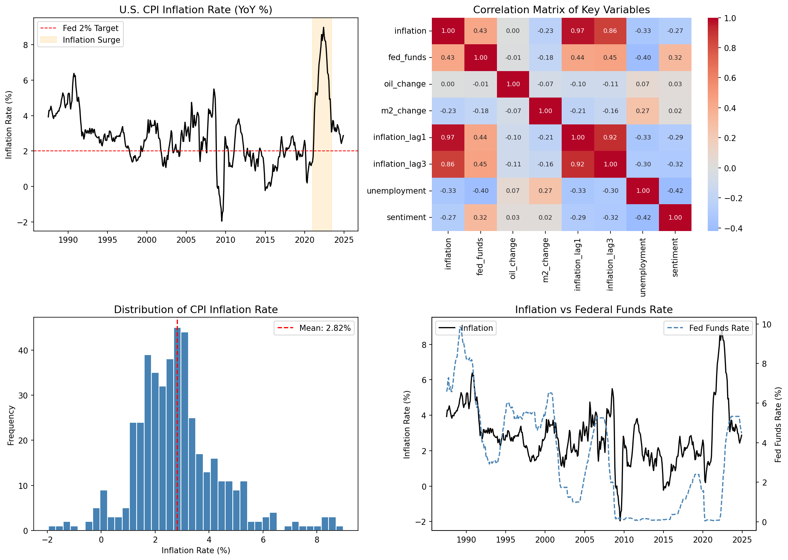

# Machine-Learning-U.S.-CPI-Inflation-Forecasting

A four-stage machine learning pipeline for forecasting U.S. Consumer Price Index (CPI) inflation, trained on 450+ months of macroeconomic data (1987–2024). Built for ECON 425: Economics & Machine Learning.

---

## Overview

This project compares the forecasting performance of four approaches — from classical econometrics to deep learning — on monthly U.S. CPI data sourced from the FRED API.

| Model | Type | Test MAE |
|---|---|---|
| **XGBoost** | Gradient Boosting | **0.641** |
| LSTM | Deep Learning (PyTorch) | 0.846 |
| ARIMAX | Time Series Econometrics | 1.752 |

**Key finding:** XGBoost outperformed LSTM despite the sequential nature of the data, likely due to sample size constraints (~450 observations) limiting the LSTM's ability to generalise. All models underestimated the 2021–2023 inflation surge, reflecting a structural break caused by COVID-19 supply shocks — a limitation acknowledged in the analysis.


---

## Pipeline

```
Raw FRED Data (10 features, ~450 months)
        │
        ▼
 [Stage 1] LASSO Feature Selection
  5-fold CV → 9 features retained (M2 growth eliminated)
        │
        ▼
 [Stage 2] ARIMAX  (order: 3,1,0 via AIC)
  Classical baseline with exogenous macroeconomic regressors
        │
        ▼
 [Stage 3] XGBoost
  GridSearchCV tuning; n_estimators=200, max_depth=3, lr=0.05
        │
        ▼
 [Stage 4] LSTM (PyTorch)
  12-month lookback, 64/32 hidden units, dropout=0.2, early stopping @ epoch 77
```

---

## Features

| Feature | Source | Notes |
|---|---|---|
| Federal Funds Rate | FRED: `FEDFUNDS` | Inverse sign in ARIMAX — reverse causality expected |
| WTI Crude Oil Price | FRED: `MCOILWTICO` | |
| Unemployment Rate | FRED: `UNRATE` | |
| Core PCE | FRED: `PCEPILFE` | |
| Personal Consumption Expenditures | FRED: `PCE` | |
| Industrial Production Index | FRED: `INDPRO` | |
| Real GDP Growth | FRED: `A191RL1Q225SBEA` | Quarterly, forward-filled |
| 10-Year Treasury Yield | FRED: `GS10` | |
| Consumer Sentiment | FRED: `UMCSENT` | |
| ~~M2 Money Supply Growth~~ | ~~FRED: `M2SL`~~ | *Eliminated by LASSO* |

---

## Model Details

### Stage 1 — LASSO Feature Selection
- 5-fold cross-validation over a log-spaced alpha grid
- Retained 9 of 10 candidate features; M2 money supply growth shrunk to zero
- Note: Standard k-fold CV used (rather than `TimeSeriesSplit`) — a known limitation discussed in the report

### Stage 2 — ARIMAX
- Order (3,1,0) selected by AIC minimisation via `statsmodels.tsa.statespace.SARIMAX`
- Differencing (d=1) applied to achieve stationarity
- Federal Funds Rate showed a negative coefficient consistent with reverse causality: the Fed raises rates *in response to* inflation, so the contemporaneous correlation is negative even though rate hikes are contractionary

### Stage 3 — XGBoost
- `GridSearchCV` over `n_estimators`, `max_depth`, and `learning_rate`
- Optimal parameters matched the baseline defaults — hyperparameter sensitivity was low for this dataset size
- Feature importance dominated by lagged CPI and crude oil prices

### Stage 4 — LSTM (PyTorch)
- 12-month lookback window; architecture: 64 → 32 hidden units → linear output
- Dropout = 0.2; Adam optimizer (lr = 0.001); early stopping triggered at epoch 77
- Built in PyTorch due to environment incompatibilities with TensorFlow on Apple Silicon (M-series Mac)
- Random seed: 42

---

## Key Findings

**1. XGBoost > LSTM on limited macroeconomic data**
Deep learning models typically require large datasets to outperform tree-based methods. With ~450 monthly observations, XGBoost's inductive bias was better suited to the problem.

**2. The 2021–2023 structural break**
All models significantly underestimated peak inflation during the post-COVID period. This is consistent with a structural break: the models were trained on a pre-COVID macroeconomic regime where supply-side shocks of that magnitude were absent from the training distribution.

**3. Federal Funds Rate as a lagging indicator**
The ARIMAX model's negative coefficient on the Federal Funds Rate is not a modelling error — it reflects the Fed's reaction function. Rate hikes follow inflation; they do not predict it in a contemporaneous regression.

**4. LASSO vs. XGBoost on M2**
LASSO eliminated M2 growth as a feature, while XGBoost retained it via its built-in feature importance mechanism. This reflects the different regularisation philosophies: LASSO performs hard variable selection, while XGBoost can exploit weak signals that global sparsity penalties discard.

---

## Repository Structure

```
CPI-Inflation-Forecasting/
├── CPI_v2.ipynb              # Main analysis notebook
├── report.pdf            # Full LaTeX report
├── figures/
│   ├── eda.png               # Exploratory data analysis
│   ├── lasso_coefficients.png
│   ├── xgb_importance.png
│   └── predictions.png       # Model predictions vs. actuals
├── requirements.txt
└── data/
    └── README.md             # Data provenance (FRED API); raw data not included
```

---

## Setup

```bash
git clone https://github.com/your-username/CPI-Inflation-Forecasting.git
cd CPI-Inflation-Forecasting
pip install -r requirements.txt
```

**Data:** All data is pulled directly from the [FRED API](https://fred.stlouisfed.org/). A FRED API key is required — register for free at https://fred.stlouisfed.org/docs/api/api_key.html. Set your key as an environment variable:

```bash
export FRED_API_KEY=your_key_here
```

Then run `CPI_ML.ipynb` top-to-bottom.

---

## Requirements

```
pandas
numpy
matplotlib
seaborn
scikit-learn
statsmodels
xgboost
torch
fredapi
```

---

## Limitations & Future Work

- **TimeSeriesSplit**: Standard k-fold CV was used for LASSO; replacing with `TimeSeriesSplit` would better respect temporal ordering and is a natural next step
- **Structural breaks**: Incorporating regime-switching models (e.g., Markov-switching ARIMA) could improve robustness to COVID-era volatility
- **External validity**: The pipeline is calibrated to the 1987–2024 U.S. macroeconomic regime; retraining would be required for other countries or time periods
- **LSTM data constraints**: Performance could improve with a longer history or higher-frequency (weekly) data

---


*Data sourced from the [Federal Reserve Economic Data (FRED)](https://fred.stlouisfed.org/) API, Federal Reserve Bank of St. Louis.*
